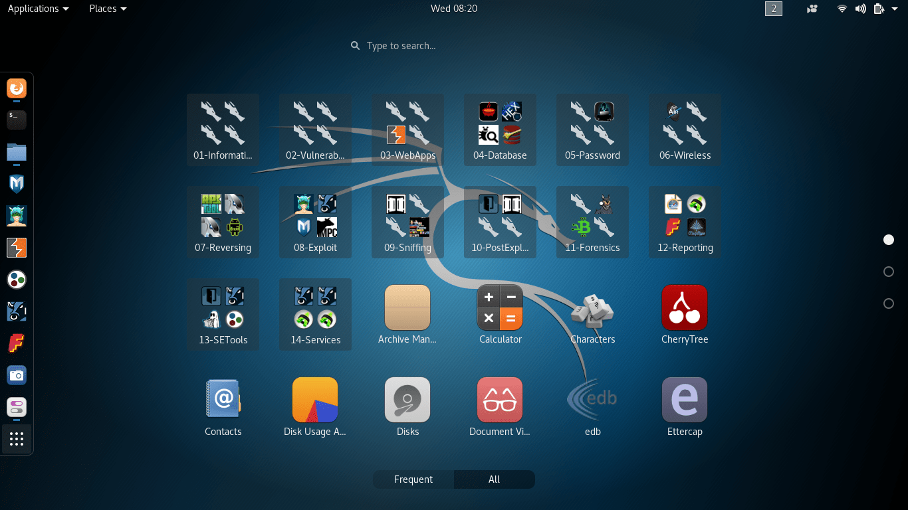

## Supported systems
#### will download 5-20 minutes




**Here on these systems works AllHackingTools** <br>
## Tool tested on:


------------------------------

**6) Run Tools**
- The user can now run the tools directly from AllHackingTools, even though they are already installed.

```
#Upgrade all & full packages
apt update
apt upgrade

#Add your termux permision
termux-setup-storage

#Install package git
apt install git

#clone this repository
git clone https://github.com/cyberanand1337x/all-hacking-tools.git
cd all-hacking-tools
chmod +X *
bash Install.sh
```

**if the error and the command does not work: cd AllHackingTools && bash fix.sh**

**And when he writes a big rainbow button: 
Done, everything is ready! Wait until you can write to the terminal.**

```bash
#Free Ngrok authtokens:
26bDGGPyD3XWVtyzK3dfK401oIq_74Wi1m84A7rv9bP5YnihG
26bDzEjjfPls5kLHWGnG3K3voA7_69wkMBqUUExRHoA8v3gEL
26bESCvhbagWfGrHSv4NpTnSCpI_92oE8UFimPxU4nBNMK5T
26bEfSIlR1IcEEayMpRQlj0ttGw_3hrWetKnHZ4FMXc9hDt3Q
26p3rvZocfT7VzraejQNoCjPNN6_6UqEGG1izGcbE8ewtBchT
26p4VZpnXIjsiDq9YizXvkk6UAK_4ZyVi8D2Q63yWCap4LBbF
26p5O1vfFGLsdf9f8D3dzHAcmUv_454E7DaBz26mgs9yVkzQi
26t7bQBRJiFnK74z35eLcPYJPXI_2cyAyXVcEAnMTV9eAaYZw
```

```bash
#configure ngrok
ngrok authtoken <↖️sеlеct free authtoken>

#start ngrok
ngrok http 80
```


##### AllHackingTools adds new commands for the terminal! All commands below

```bash
msdconsole : start AllHackingTools
msdServer  : Check AllHackingTools server
msdc       : start AllHackingTools 
Theme      : Select Termux Theme
Standart   : Select default keys
edit       : Select nano keys

Others commands:

system : View My System
sys    : View My System

Fonts Commands:

figlet -f puffy  AND  toilet -f puffy
figlet -f poison  AND  toilet -f poison
figlet -f avatar   AND  toilet -f avatar
figlet -f modular  AND  toilet -f modular
figlet -f crazy   AND  toilet -f crazy
figlet -f bloody  AND  toilet -f bloody
figlet -f rusto   AND  toilet -f rusto
figlet -f real   AND  toilet -f real
figlet -f pagga  AND  toilet -f pagga
figlet -f block  AND  toilet -f block
```
- [x] system desing
- [x] Mix Tools
- [x] technical support
- [x] In a real break-in
- [x] multi terminal
- [x] terminal customization
- [x] selection of editions
- [x] multifunctional settings
- [ ] fast download i system
- [ ] Automatic

</details>

<details id="missing-code-coverage">
   <summary>qiq more commands</summary>

##### Now when you write the qiq command in the terminal.  Many other teams will show you
##### The main commands should be written without a space, with a drawing, for example: qiq-install
##### When you write qiq-install, it will write to you Enter module name to install and write the name of the module you want to download, for example: git, python, wget

```
>>> qiq-help      :view more qiq info
>>> qiq-update    :update qiq
>>> qiq-version   :view qiq version
>>> qiq-author    :view qiq author
>>> qiq-install   :install packages
>>> qiq-remove    :remove packages
>>> qiq-reinstall :reinstall packages
┐─┐┐ ┬┐─┐┌┐┐┬─┐┌┌┐  ┌─┐┌─┐┌┌┐┌┌┐┬─┐┌┐┐┬─┐┐─┐
└─┐└┌┘└─┐ │ ├─ │││  │  │ ││││││││─┤││││ │└─┐
──┘ ┆ ──┘ ┆ ┴─┘┘ ┆  └─┘┘─┘┘ ┆┘ ┆┘ ┆┆└┘┆─┘──┘
>>> qiq-proces    :view system process
>>> qiq-smalltext :create small logo
>>> qiq-bigtext   :create big logo
>>> qiq-rgb       :create medium colored logo
>>> qiq-rcolor    :create medium rainbow logo
>>> qiq-mysystem  :view my system
>>> qiq-home      :cd to derictory
>>> qiq-usr       :cd to derictory
>>> qiq-bin       :cd to derictory
┬─┐o┌─┐┬  ┬─┐┌┐┐  ┌┐┐┬─┐┐ ┬  ┌─┐┌─┐┌┌┐┌┌┐┬─┐┌┐┐┬─┐┐─┐
├─ ││ ┬│  ├─  │    │││├─ │││  │  │ ││││││││─┤││││ │└─┐
┆  ┆┆─┘┆─┘┴─┘ ┆   ┆└┘┴─┘└┴┆  └─┘┘─┘┘ ┆┘ ┆┘ ┆┆└┘┆─┘──┘
>>> figlet -f Puffy   :no description
>>> figlet -f Bloody  :no description
>>> figlet -f Poison  :no description
>>> figlet -f Block   :no description
>>> figlet -f Avatar  :no description
>>> figlet -f Crazy   :no description
>>> figlet -f Modular :no description
>>> figlet -f Basic   :no description
>>> figlet -f Rusto   :no description
>>> figlet -f Pagga   :no description
┌─┐┌┐┐┬ ┬┬─┐┬─┐  ┌─┐┌─┐┌┌┐┌┌┐┬─┐┌┐┐┬─┐┐─┐
│ │ │ │─┤├─ │┬┘  │  │ ││││││││─┤││││ │└─┐
┘─┘ ┆ ┆ ┴┴─┘┆└┘  └─┘┘─┘┘ ┆┘ ┆┘ ┆┆└┘┆─┘──┘
>>> qiq-AllHackingTools :Install AllHackingTools
>>> qiq-FreeProxy       :Install Free-Proxy
>>> qiq-AdminHack       :Install AdminHack
```
</details>


----
#### When prompted for the download type: Default/Coded

> **Choose which installation is more convenient for you**

> **If you can't download Default then choose: Coded**

> **It is recommended to choose: Default**
----------

<details id="missing-code-coverage">
  <summary>Need Help</summary>

#### And I will consider your letter and problem!

```bash
Emails:
 developer.mishakorzhik@gmail.com

Developers:
 mishakorzhik
```

## Bug?
If the tool fails, follow these steps:

1. Take a screenshot and see the error 
   in detail

2. Contact me through the following 
   
3. Submit the screenshot and explain 
   your problem with that error

</details>

<details id="missing-code-coverage">
  <summary>Versions</summary>

### Version 2.6.3
##### below is a list added in version 2.6

```

Desing:
 Many bugs have been fixed

Tools:
 Added new tools!

#Thanks for reviewing the update list. 
#Bye bye Have a nice day!
```

### Version 2.5.1
##### below is a list added in version 2.5

```

Desing:
 Many bugs have been fixed
 Added New Castomization
 New Loading animation
 Added checking for ping

Build:
 Added new optimization
 Added stabilization
 Added new programming code PHP

#Thanks for reviewing the update list. 
#Bye bye Have a nice day!
```


### Version 2.4
##### below is a list added in version 2.4

```

Tools:
 Many new utilities have been added

Desing:
 Many bugs have been fixed
 Added New Castomization
 Added Castomization for loading

#Thanks for reviewing the update list. 
#Bye bye Have a nice day!
```

### Version 2.3
##### below is a list added in version 2.3

```

Tools:
 Many new utilities have been added

Desing:
 Many bugs have been fixed
 Added New Commands
 Added New Castomization

#Thanks for reviewing the update list. 
#Bye bye Have a nice day!
```

### Version 2.2
##### below is a list added in version 2.2

```bash

Tools:
 Many new utilities have been added

Desing:
 Many bugs have been fixed
 New logo designs were added
 New Menu desings were added
 New AllHackingTools download design 

#Thanks for reviewing the update list. 
#Bye bye Have a nice day!
```

### Version 2.1
##### below is a list added in version 2.1

```bash

Tools:
 Two new menu options have been added
 Many new utilities have been added

Desing:
 Many bugs have been fixed
 Two new logo designs were added

#Thanks for reviewing the update list. 
#Bye bye Have a nice day!
```

#### Okay let's go installing! If it shows Are you rooted? Then ignore it!
---------
## What does it download?

* `git` `python` 
* `wget` `curl`
* `openssh` `php`
* `toilet` `colorama`
* `jq` `apache2`
* `ruby` `ssl`
* `w3m` `figlet`
* `zip` `lolcat`
* `pv` `neofetch`
* `zsh` `ngrok`

#### And more packages!
------
## Donate

**If you want to donate, click on the button**


-----
## Download more utility for hacking!

#### uninstall AllHackingTools

* `bash Uninstall/Uninstall.sh`

------

#### It downloads packages and utilities and configures the utilities.


